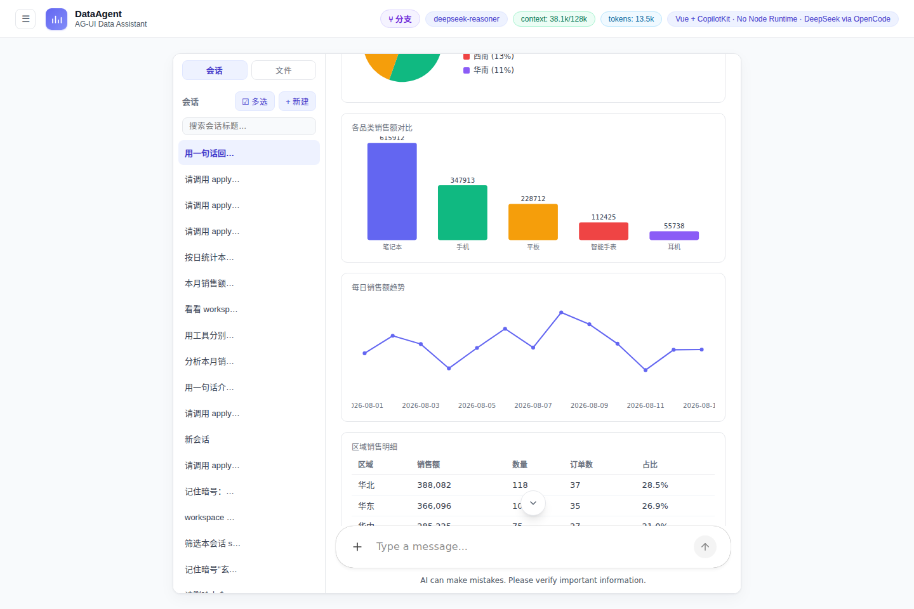

# DataAgent

AI Data Agent Web App：Vue 3 + @copilotkit/vue(fork) 前端 → Java gateway(:8090, Spring WebFlux) → OpenCode server(:4096, bun) → DeepSeek。协议栈 AG-UI + A2UI，全链路无 Node runtime、无 mock。



> 公网实例 `http://101.34.246.179/agui/` 实拍（2026-08-16，真实 DeepSeek 应答，非 mock）。

## 快速开始

```bash
scripts/up.sh    # 幂等拉起/自检三件套（opencode :4096 + gateway :8090 + vite :3001）
```

交付级重建/部署/溯源说明见 **[DELIVERY-README.md](DELIVERY-README.md)**；开发纪律与布局见 **[CLAUDE.md](CLAUDE.md)**。

## 权威文档（docs/）

| 文档 | 内容 |
|---|---|
| [PRODUCT_REQUIREMENTS.md](docs/PRODUCT_REQUIREMENTS.md) | 产品需求与验收口径 |
| [CURRENT_ARCHITECTURE.md](docs/CURRENT_ARCHITECTURE.md) / [TARGET_ARCHITECTURE.md](docs/TARGET_ARCHITECTURE.md) | 架构现状 / 目标 |
| [DEVELOPMENT_STATUS.md](docs/DEVELOPMENT_STATUS.md) | 当前完成度、P0/P1/P2 问题清单、下一步 |
| [ACCEPTANCE_TESTS.md](docs/ACCEPTANCE_TESTS.md) | 端到端验收场景与可执行脚本 |
| [FORK-UPGRADE-PATH.md](docs/FORK-UPGRADE-PATH.md) | fork vendor patch 清单与上游升级路径（P25 抽查） |

## 测试

```bash
cd vue-frontend && ./node_modules/.bin/vitest run   # 前端全量（无 npx）
mvn -f gateway/pom.xml test                          # gateway 全量
scripts/test-multi-turn.sh                           # 真实 5 轮回归（需三件套在线）
```
